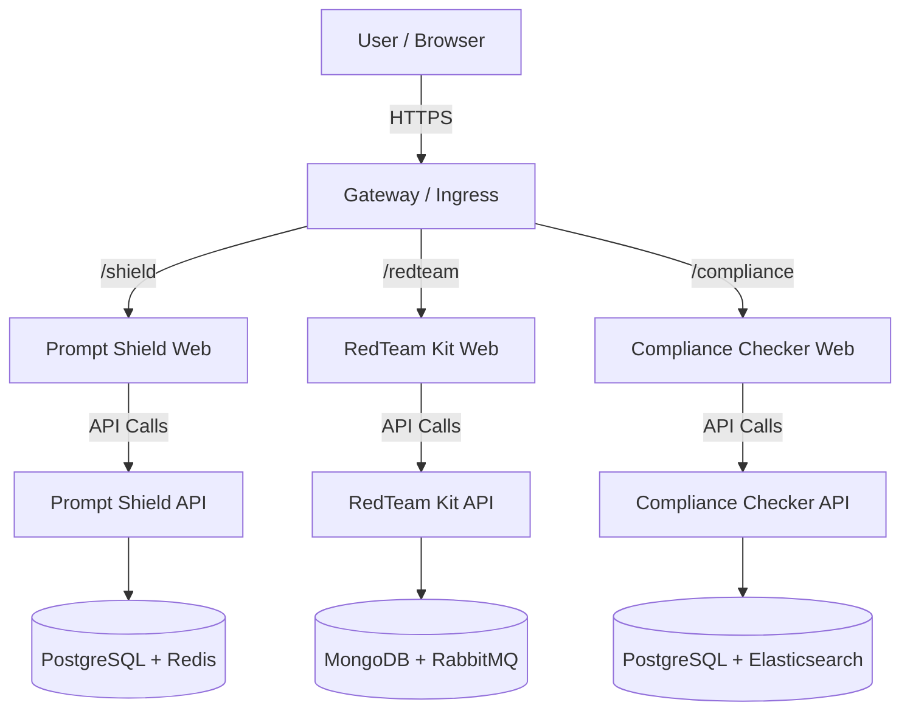

# Architecture Overview

The Apire AI Security Platform is a suite of three independent security tools, each following a microservices architecture with dedicated frontend, backend, and data layers.

## High-Level Design



## Security Tools

### 1. Prompt Shield
**Purpose**: Real-time defense against prompt injection and jailbreak attempts

- **Frontend**: React + Vite + Tailwind CSS
- **Backend**: Node.js + Express + TypeScript
- **Database**: PostgreSQL (analysis logs) + Redis (caching)
- **Ports**: API (3001), Web (3002)
- **Key Features**:
  - Pattern-based injection detection
  - Jailbreak prevention
  - PII scanning and redaction
  - Real-time risk scoring

### 2. RedTeam Kit
**Purpose**: Advanced adversarial testing and security auditing toolkit

- **Frontend**: Next.js + React + Tailwind CSS
- **Backend**: NestJS + TypeScript
- **Database**: MongoDB (scenarios/reports) + RabbitMQ (async jobs)
- **Ports**: API (3005), Web (3006)
- **Key Features**:
  - Pre-built attack scenarios
  - Automated fuzzing
  - Comprehensive reporting
  - Custom attack vector support

### 3. Compliance Checker
**Purpose**: Automated regulatory compliance scanner

- **Frontend**: Vue.js + Vite + Tailwind CSS
- **Backend**: Node.js + Express + TypeScript
- **Database**: PostgreSQL (audit logs) + Elasticsearch (full-text search)
- **Ports**: API (3003), Web (3004)
- **Key Features**:
  - GDPR, HIPAA, SOC 2, CCPA support
  - Automated policy validation
  - Gap analysis
  - Remediation guidance

## Design Principles

1. **Independence**: Each tool operates standalone with its own data layer
2. **Modularity**: Use only the tools you need
3. **Scalability**: Each service scales independently
4. **Resilience**: Service failures don't cascade
5. **Flexibility**: Deploy together or separately

## Deployment Architecture

### Development (Docker Compose)
```yaml
# docker-compose.codespaces.yml
services:
  # Prompt Shield
  shield-api, shield-web, shield-postgres, shield-redis
  
  # RedTeam Kit
  redteam-api, redteam-web, redteam-mongo, redteam-rabbitmq
  
  # Compliance Checker
  compliance-api, compliance-web, compliance-postgres, compliance-redis
```

### Production (Kubernetes)
```bash
kubernetes/
├── base/              # Shared resources
├── prompt-shield/     # Prompt Shield manifests
├── redteam-kit/       # RedTeam Kit manifests
└── compliance-checker/ # Compliance Checker manifests
```

## Data Flow Examples

### Prompt Shield - Injection Detection Flow
```
1. User Input → Frontend (React)
2. POST /api/v1/test → Backend API (Express)
3. Validation Layer (Zod schemas)
4. Detection Engine (Pattern matching + Heuristics)
5. Risk Calculation (Scoring algorithm)
6. Database Logging (PostgreSQL)
7. Cache Update (Redis)
8. Response → Frontend → User
```

### RedTeam Kit - Attack Simulation Flow
```
1. User Selects Scenario → Frontend (Next.js)
2. POST /api/v1/scenarios/run → Backend API (NestJS)
3. Scenario Loader (MongoDB)
4. Queue Job (RabbitMQ)
5. Attack Executor (Async worker)
6. Results Aggregation
7. Report Generation (PDF/JSON)
8. Response → Frontend → User
```

### Compliance Checker - Audit Flow
```
1. User Initiates Scan → Frontend (Vue.js)
2. POST /api/v1/scan → Backend API (Express)
3. Policy Loader (Framework selection)
4. Async Scanner (Check executor)
5. Evidence Collection (PostgreSQL)
6. Search Indexing (Elasticsearch)
7. Gap Analysis (Remediation engine)
8. Response → Frontend → User
```

## Security Architecture

### API Security
- Input validation with Zod
- Rate limiting (configurable per tool)
- CORS configuration
- Optional API key authentication
- Helmet.js security headers

### Network Security
- Each tool in isolated network namespace
- Internal service communication only
- Public exposure via gateway/ingress
- TLS/HTTPS for external traffic

### Data Protection
- Environment variables for secrets
- Docker/K8s secrets management
- Database encryption at rest (configurable)
- Audit logging
- PII redaction options

## Technology Stack

| Layer | Technologies |
|-------|-------------|
| **Frontend** | React, Next.js, Vue.js, Vite, Tailwind CSS |
| **Backend** | Node.js, Express, NestJS, TypeScript |
| **Validation** | Zod |
| **Databases** | PostgreSQL, MongoDB, Redis, Elasticsearch |
| **Messaging** | RabbitMQ |
| **Containerization** | Docker, Docker Compose |
| **Orchestration** | Kubernetes |
| **Testing** | Jest, Vitest, Playwright, k6 |
| **CI/CD** | GitHub Actions |

## Observability

### Logging
- Structured JSON logs (Winston)
- Centralized log aggregation (planned)
- Configurable log levels

### Metrics
- Prometheus-compatible endpoints
- Custom metrics per tool
- Health check endpoints (`/health`, `/health/ready`)

### Monitoring
```
GET /health       - Liveness probe
GET /health/ready - Readiness probe (DB checks)
GET /metrics      - Prometheus metrics
```

## Scalability Considerations

### Horizontal Scaling
```bash
# Scale individual services
docker-compose up --scale shield-api=3
kubectl scale deployment shield-api --replicas=5
```

### Caching Strategy
- Redis for frequent queries (Prompt Shield)
- API response caching with TTL
- CDN for static assets

### Database Optimization
- Connection pooling
- Read replicas for high load
- Indexing on frequently queried fields
- Query optimization

## Future Enhancements

- [ ] Unified SDK (@apire/sdk) for all three tools
- [ ] Centralized observability dashboard
- [ ] Service mesh integration (Istio/Linkerd)
- [ ] Multi-region deployment support
- [ ] Real-time collaboration features

## Further Reading

- [Deployment Guide](./DEPLOY_ON_CODESPACES.md)
- [Testing Guide](./TESTING.md)
- [API Reference](./API.md)
- [GitHub Wiki](https://github.com/apireaisecurity/apire-ai-security-platform/wiki)
