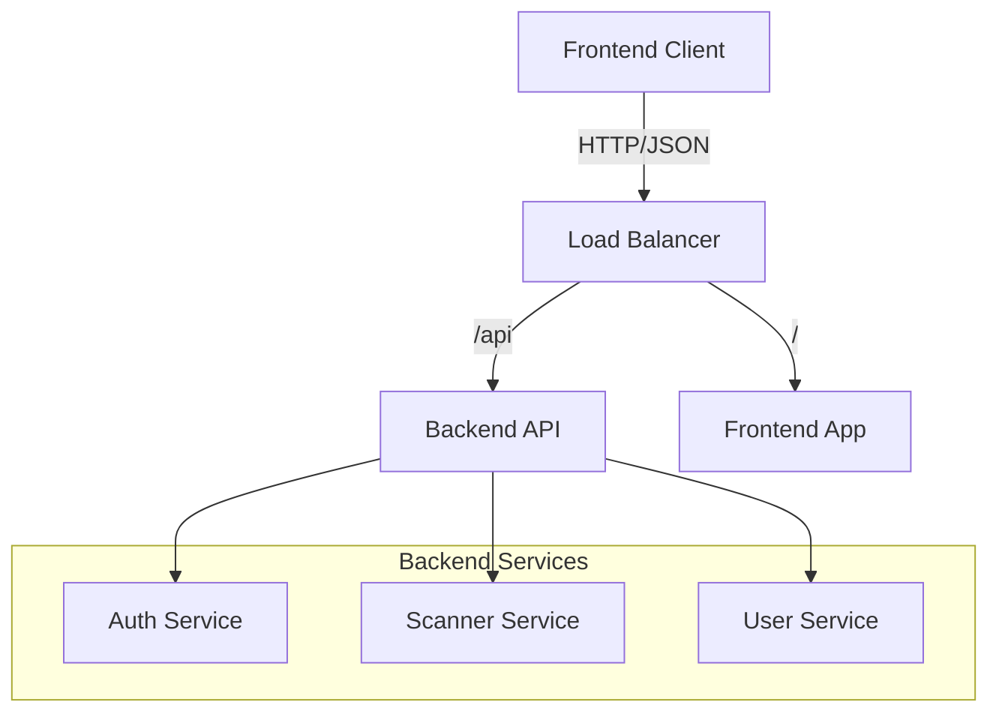

# Architecture Overview

The Apire AI Security Platform follows a microservices-ready architecture, currently implemented as a modular monolith for simplicity and ease of development.

## High-Level Design

## Components

### Frontend
- **Framework**: React with Vite
- **Styling**: Tailwind CSS
- **State Management**: React Query (planned)
- **Routing**: React Router

### Backend
- **Runtime**: Node.js
- **Framework**: Express
- **Language**: TypeScript
- **Validation**: Zod
- **Security**: Helmet, CORS

## Data Flow

1. **User Request**: The user interacts with the Frontend Dashboard.
2. **API Call**: The Frontend sends a request to the Backend API (e.g., `/api/v1/scanner`).
3. **Authentication**: The `AuthMiddleware` verifies the JWT token.
4. **Validation**: The Controller validates the input using Zod schemas.
5. **Processing**: The Service (e.g., `ScannerService`) processes the request.
6. **Response**: The result is returned to the Frontend.

## Security Considerations

- **JWT Authentication**: Stateless authentication using JSON Web Tokens.
- **Input Validation**: Strict validation of all inputs using Zod.
- **Secure Headers**: Helmet.js for setting secure HTTP headers.
